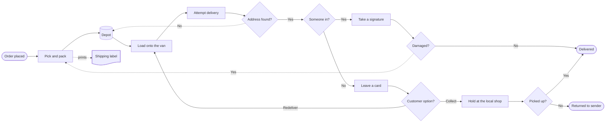

*Published August 28, 2026 at 9:04 PM ET*

For years, browser-based diagramming has relied on a predictable set of tools. When developers write Mermaid markup inside documentation sites or issue trackers, the underlying engine almost always hands off positioning tasks to Dagre. Dagre uses a classic Sugiyama-style layered layout approach, placing nodes into discrete ranks and attempting to minimize edge crossings. It works. However, it often produces rigid, sprawling layout trees with awkward connector paths and limited visual control. [Line9](https://line9.ai/diagram) takes a fundamentally different path. Instead of wrapping Dagre or generic graph libraries, Line9 implements its own dedicated graph layout engine built specifically for parsing and rendering Mermaid markup.

The core problem with standard graph positioning engines stems from how general they try to be. Generic graph layout engines treat every node as a uniform rectangle and every edge as a generic spline. They do not understand the domain-specific semantics embedded inside diagram markup. When a developer builds a complex delivery workflow or system state machine in Mermaid, a decision diamond requires different spatial constraints than a standard process box or a database bucket. Dagre often stretches edges across vast empty stretches of canvas just to satisfy rank alignment. That layout rigidity leaves frontend engineers stuck tweaking inline HTML wrappers or injecting raw SVG hacks when a flow diagram becomes unreadable.

## Parsing Declarative Syntax and Semantic Role Mapping

Line9 begins by parsing standard flowchart Domain Specific Language (DSL) statements directly into an intermediate geometric representation. It handles standard directed connections like `-->`, dashed relationships like `.->`, and explicit node shape annotations such as `label@{ shape: doc, label: "Shipping label" }`. Branching logic gets parsed as distinct structural primitives, recognizing syntactic decision nodes like `{Address found?}` or `{Someone in?}`.

The parser goes beyond basic geometric shapes. It reads explicit class mappings to assign semantic visual roles to specific elements in the graph. In a parcel delivery workflow, syntax like `class found,in,damaged,choice,picked gate` designates conditional nodes as decision gates. Simultaneously, statements like `class label,depot artifact` and `class done,back ending` map physical data stores and terminal outcomes into distinct visual tiers. Separating topology from semantic styling allows the engine to apply specialized layout rules based on node function. A gate node can reserve tighter margin bounds for label text along branching output edges, while an artifact node maintains fixed target anchor points.

## Dedicated Layout Math vs Off-the-Shelf Graph Libraries

Replacing Dagre with a custom layout engine introduces tough engineering trade-offs. Standard open source diagram tools take the easy path. They outsource geometry calculations to existing JavaScript modules, treating node coordinates as fixed outputs generated inside an isolated routine. Line9 rejects that black-box approach. Its proprietary positioning engine integrates node sizing, edge routing, and label collision directly into a unified rendering loop.

Direct control over the geometry solver opens up UI-level layout knobs that standard Mermaid renderers cannot offer. In the [Line9 web editor](https://line9.ai/diagram), users adjust global orientation settings like left-to-right (`LR`) alongside dynamic spacing algorithms, node sizing parameters, and preset visual themes like `boardroom`. Change the node size control, and the layout engine re-evaluates rank boundaries instantly without breaking edge trajectories or pushing adjacent labels into overlapping coordinates.

Collision avoidance in custom layout engines is notoriously hard. When directed graphs contain multiple feedback loops, such as an undelivered parcel returning to a regional depot or a damaged item forcing a re-pack step, standard layered algorithms frequently route dashed lines straight through intermediate nodes. Line9 avoids this by calculating edge paths against bounding boxes and custom clearance zones. The result is a cleaner diagram, though it demands significantly more computation during rapid edits on dense graphs.

## Real-Time Synchronization and Execution Workflows

Editing declarative visual markup in a browser requires tight feedback loops between the code panel and the SVG viewport. If a user edits a node label or inserts a new decision branch in the source text, the rendered canvas must reflect those edits instantly. Line9 manages this through an automated desynchronization detector. When the source code is modified in the browser editor, the UI immediately surfaces an inline status warning reading "Diagram is out of date with the source." This explicit state flag prevents developers from copying stale share links or exporting outdated vector graphics.

Tooling flexibility matters just as much as browser rendering. Graphical editors are convenient for quick drafting, but modern engineering teams rely heavily on automated documentation builds in continuous integration pipelines. Line9 addresses this by providing both its interactive web interface and a standalone command-line executable called `line9 CLI`. Developers can preview diagrams interactively in the browser, tweak spacing parameters, pick visual themes, and then execute the exact same rendering engine in headless local scripts or automated build pipelines.

## Architecture Limits and Layout Trade-offs

Building a dedicated layout engine for Mermaid markup solves long-standing visual quirks, but it creates an ongoing engineering burden. Standard Mermaid supports a broad range of diagram families beyond flowcharts, including sequence diagrams, state charts, entity relationship models, and Gantt timelines. Focusing heavily on optimizing flowchart topology, directed connectors, and semantic CSS class bindings leaves open questions about how easily this custom engine can scale to accommodate every niche syntax extension in the Mermaid specification.

If you rely on custom node styling or precise spatial relationships in your operational flowcharts, testing the layout behavior in [Line9](https://line9.ai/diagram) offers a clear window into how modern vector layout can move beyond generic rank-based placement. How well these custom positioning algorithms handle massive, highly dense graphs with hundreds of cyclic edges will determine whether dedicated layout engines completely displace legacy Dagre wrappers across the wider developer visualization ecosystem.

## Further reading

- [https://line9.ai/diagram](https://line9.ai/diagram)
- [https://www.docker.com/products/docker-sandboxes/](https://www.docker.com/products/docker-sandboxes/)
- [https://scalex.dev/blog/ai-agent-permissions-stats/](https://scalex.dev/blog/ai-agent-permissions-stats/)
- [https://acceptmarkdown.com/](https://acceptmarkdown.com/)
- [https://www.codewithbullet.com](https://www.codewithbullet.com)
- [https://arxiv.org/abs/2608.02412](https://arxiv.org/abs/2608.02412)
- [https://hoplite.sh](https://hoplite.sh)
- [https://github.com/yaroslav/kino](https://github.com/yaroslav/kino)

